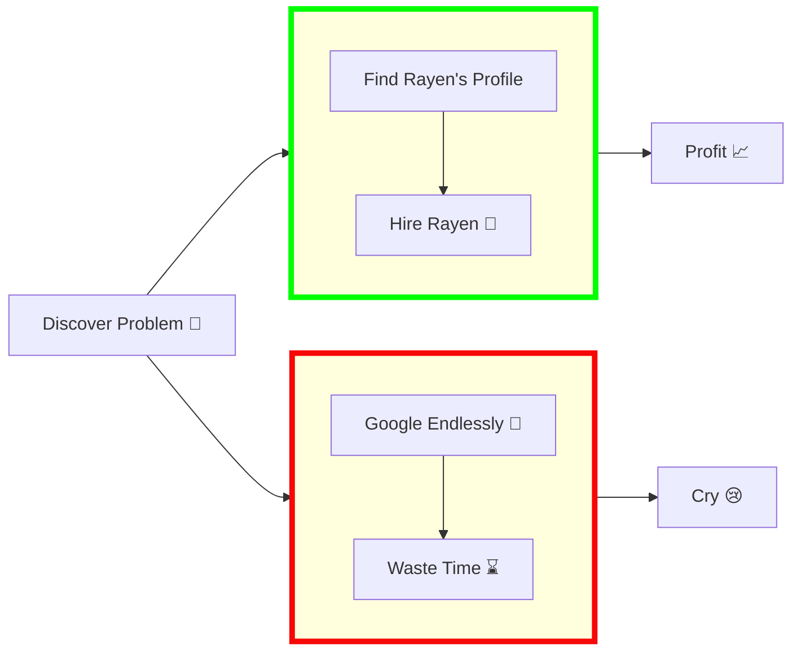

```mermaid
flowchart LR
    direction LR
    subgraph 1[" "]
        direction TB
        top1[Find Rayen's Profile] --> bottom1[Hire Rayen 🤝]
    end
    subgraph 2[" "]
        direction TB
        top2[Google Endlessly 🔎] --> bottom2[Waste Time ⌛]
    end

    %% Link to subgraph1
    3[Discover Problem 🐛] --> 1

    %% Link within subgraph2
    3[Discover Problem 🐛] --> 2

    1 --> outside1["Profit" 📈]
    2 --> outside2["Cry" 😢]

    click top1 "https://www.linkedin.com/in/rayen-korbi-4ab072240/" "LinkedIn"

    style 1 stroke:#00FF00,stroke-width:5px
    style 2 stroke:#f70707,stroke-width:5px
```

 
 
 
 

 
 
 

  

 

<b>Visitors Count</b>
  

 

